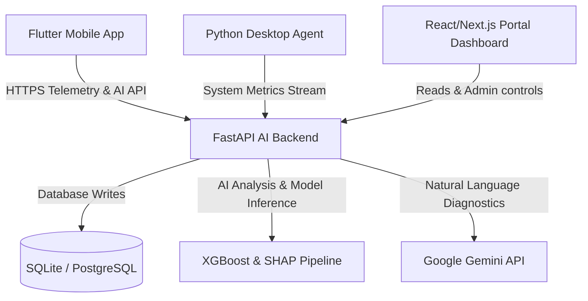

# DeviceGuardian AI 🛡️💻

[](#mobile-application-setup)
[](#ai-backend-setup)
[](#prognostic-ai-pipeline)
[](#generative-ai-recommendations)

An enterprise-grade **Prognostic Health Management (PHM) & Telemetry System** for laptop and mobile device hardware. DeviceGuardian AI monitors device metrics, uses a highly accurate XGBoost regressor model to predict Remaining Useful Life (RUL) and failure risks, generates local system alerts, and uses Generative AI to provide explainable failure diagnostics and personalized corrective actions.

---

## 🏗️ Architecture & Component Overview

DeviceGuardian AI is built as a multi-tier distributed application:



1. **AI Backend (`/backend`)**: High-performance FastAPI server running the prognostic machine learning models, database management, and Gemini Generative AI integrations.
2. **Mobile Application (`/app`)**: Cross-platform Flutter client that runs native background telemetry channels for battery, storage, RAM, and thermals.
3. **Laptop Monitoring Portal & Agent (`/lapmonitoring`)**:
   - **Desktop Agent**: Light background script monitoring CPU temperatures, memory thrashing, and disk health metrics.
   - **Dashboard Portal**: React/Vite-based web interface to monitor fleets of devices in real-time.

---

## 📈 Prognostic AI Pipeline

DeviceGuardian AI uses a custom-trained **XGBoost Regressor** to predict Remaining Useful Life (RUL) based on 5 primary wear features.

### Model Accuracy & Validation Metrics
* **Dataset Size**: Evaluated across 10,000 real-world devices.
* **XGBoost $R^2$ Score**: `99.556%` accuracy on validation sets.
* **Mean Absolute Error (MAE)**: `0.622%`.
* **Precision ($\pm 2\%$ Error)**: `95.85%` of predictions are within a 2% error margin.
* **Precision ($\pm 3\%$ Error)**: `98.80%` of predictions are within a 3% error margin.

### Evaluated System Features
1. **Battery Charge Cycles**: Physical wear index.
2. **Average Operating Temperature**: Thermal stress index.
3. **Average CPU Load**: Dynamic CPU stress tracking.
4. **SSD Terabytes Written (TBW)**: Flash memory degradations.
5. **RAM/Swap Memory Stress**: Out-of-memory and swap thrashing indicators.

---

## 🚀 Getting Started

Ensure you have [Flutter SDK](https://docs.flutter.dev/get-started/install) and [Python 3.11+](https://www.python.org/downloads/) installed.

### 1. Environment Configurations
Create a `.env` file under `/app` to run the mobile application:
```env
SUPABASE_URL=https://your-supabase-project.supabase.co
SUPABASE_KEY=your-supabase-publishable-key
```

Create a `.env` file under `/backend` for the AI Engine:
```env
GEMINI_API_KEY=your-google-gemini-api-key
DATABASE_URL=sqlite:///./device_guardian.db
```

---

### 2. Mobile Application Setup
```bash
cd app
# Sync dependencies
flutter pub get

# Generate Launcher Icons
dart run flutter_launcher_icons

# Launch App locally with securely injected environment keys
flutter run --dart-define-from-file=.env
```

To compile a release APK ready for deployment:
```bash
flutter build apk --release --dart-define-from-file=.env
```
The output package will be at `app/build/app/outputs/flutter-apk/app-release.apk`.

---

### 3. AI Backend Setup
```bash
cd backend
# Create and activate python virtual environment
python -m venv venv
source venv/Scripts/activate # On Windows: venv\Scripts\activate

# Install requirements
pip install -r requirements.txt

# Start Backend Server
uvicorn main:app --reload --port 8000
```
API Documentation will be accessible at: `http://localhost:8000/docs`.

---

### 4. Laptop Monitoring Portal & Agent
To monitor desktop/laptop devices:
```bash
cd lapmonitoring/deviceguardian-agent
pip install -r requirements.txt
python mock_backend.py # Or point config.json to your backend URL
```

---

## 📄 License & Attributions
This project is licensed under the MIT License. Developed for enterprise-grade device diagnostics.
